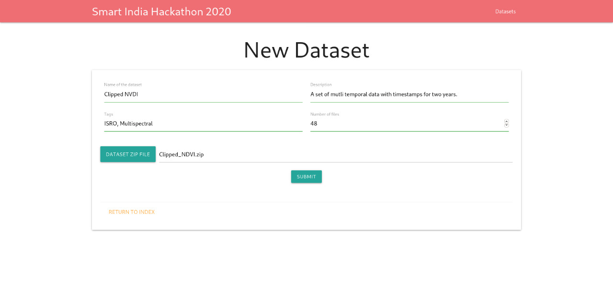
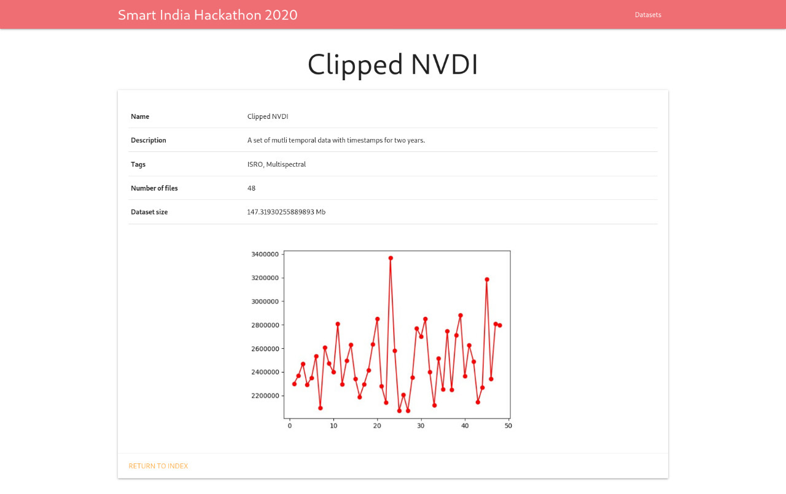

# Extraction of Crop Cycle Parameters

TODO: Add description

## Technologies Used
- Flask
- Android Studio
- OpenCV
- Matlab

## Screenshots
### Web Application
- 
- 
- 

## Setup Instrucions
- For Setup instructions, refer to the README of individual components.

## Team Members
- K Krishna Swaroop
- Abhishek Kumar
- Harsh Agarwal
- V R Sandeep
- Harshavardhan R
- P Akshara